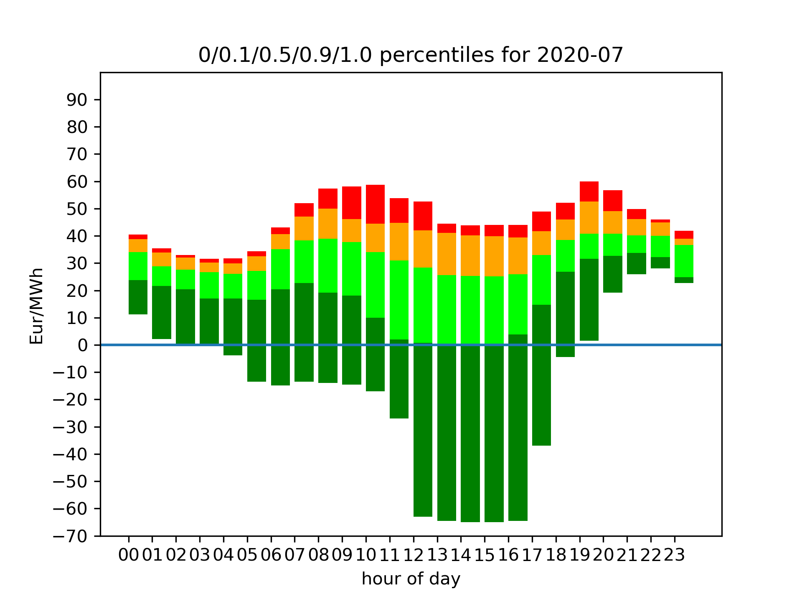

# Statistics for aWATTar hourly tariff

There is a new, very interesting offer in Germany for a dynamic power contract.
The company is called [aWATTar](https://www.awattar.de) and offers an HOURLY tariff which is based on the EPEX Spot Day-Ahead price.
I don't have a smart meter yet and only know my yearly power consumption.
So I wasn't able to use the [Lohnt sich aWATTar?](https://github.com/foscoj/lohnt-sich-awattar) project.

I wanted to be able to get some rough idea about the expected costs of aWATTar HOURLY and therefore I created this visualization script.

# Data Source

The source of this data is the official (German) [aWATTar API](https://www.awattar.de/services/api).
**Please note that this price is without VAT.**
So you will need to add 19% in order to get the actual prices for customers.

All data is only collected once and then cached.
For convenience, this repository comes with the pre-downloaded data from ```2013-12-22``` until ```2021-09-24```.

# Usage

In order to get the latest daily data, please run ```./awattar-statistics.py update``` first.
This will download and append the missing data to the file ```historical-data.txt```.

Then run ```./awattar-statistics.py calculate``` which will create all the files and visualizations.
This will take a few minutes of generation.

# Output

This script outputs a few CSV files which you can use for further processing, for instance Libreoffice Calc or Excel.
The following three outputs are created:

* **daily prices** (```data/daily/2020-04-22.txt```): prices per hour, format is ```{hour};{price}```. Please note that there might be 25 or 23 hours on days where daylight saving changes, i.e. there might be no hour ```02``` or two hours ```02a``` and ```02b```.
* **monthly minimum, average, median and maximum prices** (```data/monthly/2020-08-*.txt```): Those files contain the hourly minimum, average, median or maximum prices for the whole month.
* **yearly minimum, average, median and maximum prices** (```data/yearly/2020-*.txt```): Those files contain the hourly minimum, average, median or maximum prices for the whole year.

There are three types of visualizations:

* **daily charts** (```plot/daily/2020-04-22.png```): bar chart for a single day
* **monthly percentile charts** (```out/plot/monthly/2020-08.png```): percentile chart for a month
* **yearly percentile charts** (```out/plot/yearly/2020.png```): percentile chart for a complete year

I find the monthly percentile charts the most interesting. Those look like the following:

This graph shows the percentiles for each hour:

* The minimum 12:00-13:00 price in July 2020 was -6ct per kWh.
* 10% of the days, the 12:00-13:00 price was below zero, 90% it was above.
* The median price for 12:00-13:00 was a little below 3ct per kWh. 50% of the days, the price between 12:00 and 13:00 was therefore below 3ct per kWh and the other half of the days, the price was above.
* The maximum price between 12:00 and 13:00 in July 2020 was around 5.5ct per kWh.

# Contributing

If you want to have another visualization, please feel free to open an issue or - if you can - a pull request.

